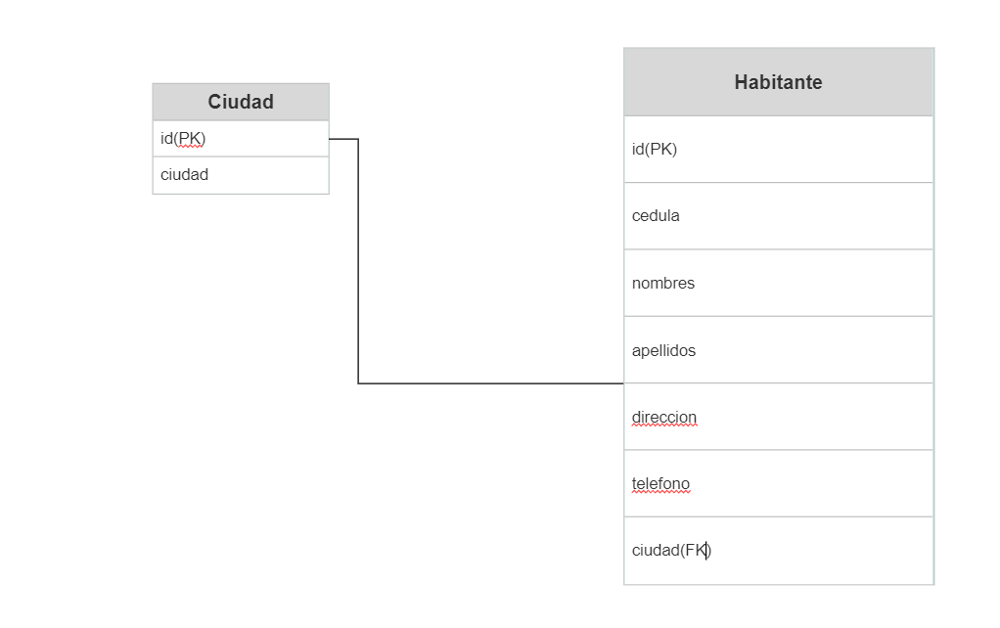

# Tabla de Contenido
1. [Requerimiento](#requerimiento)
2. [Instalación](#inst)
3. [Request por API](#api)
4. [Base de Datos](#bd)
***
<a name="requerimiento"></a>
# -> Requerimiento
### Debe crear una API Rest usando Django Rest Framework, que permita registrar los habitantes de las distintas ciudades de Colombia.

a. Debe realizar las 5 acciones básicas (GET, POST, PUT, DELETE, PATCH).

b. Se debe poder ingresar los datos básicos del habitante como: nombres,
apellidos, dirección, teléfono, cédula, ciudad.

c. Tenga en cuenta que cada habitante, está asociado a una ciudad.

d. Construir y adjuntar el diagrama del modelo entidad-relación de la solución
(en caso de que use un modelo relacional).

e. Exponer servicios que permitan realizar la gestión de habitantes y
ciudades.

***
<a name="inst"></a>
# -> Instalación
## Python 3.9.8

### Una vez clonado el repositorio, nos moveremos por la CONSOLA a la carpeta del Proyecto
### Procederemos a activar el Entorno Virtual, Instalar los Requeriments.txt y arrancar el Servidor.
### Se configuro el superusuario con admin y password admin
```
$ cd C:\Users\UserName\Documents\ORUSXPERT
$ venv\Scripts\activate.bat
$ (venv) pip install -r requirements.txt 
$ (venv) python manage.py runserver
```

### Ruta del servidor
```
http://localhost:8000/
http://127.0.0.1:8000/
```
***
<a name="api"></a>
# -> Request por API

## ■ CLASE DE CIUDADES
### Se ha poblado la tabla con algunas ciudades, para ello ejecutar el siguiente comando.
```
py manage.py updatemodels
```
### La API tiene el metodo GET, POST, PUT, DELETE bajo la siguiente ruta:
```
http://localhost:8000/api/ciudades/
```

### Y getById bajo la siguiente:
```
http://localhost:8000/api/ciudades/ID
```

## ■ CLASE DE HABITANTES
### No se creo comando para poblar habtantes.
```
```
### La API tiene el metodo GET, POST, PUT, DELETE bajo la siguiente ruta:
```
http://localhost:8000/api/ciudades/
```
***
<a name="bd"></a>
# -> MODELO ENTIDAD-RELACION
***

***